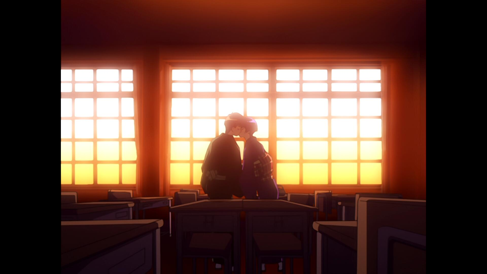
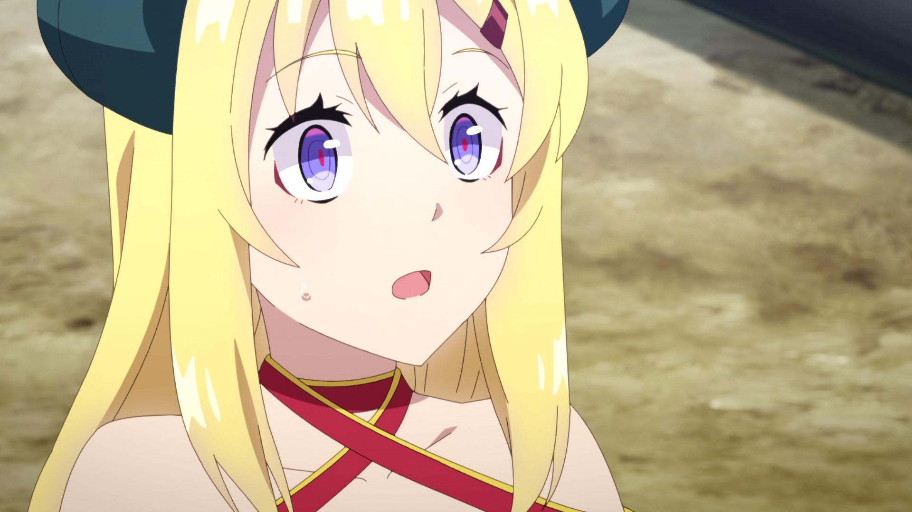
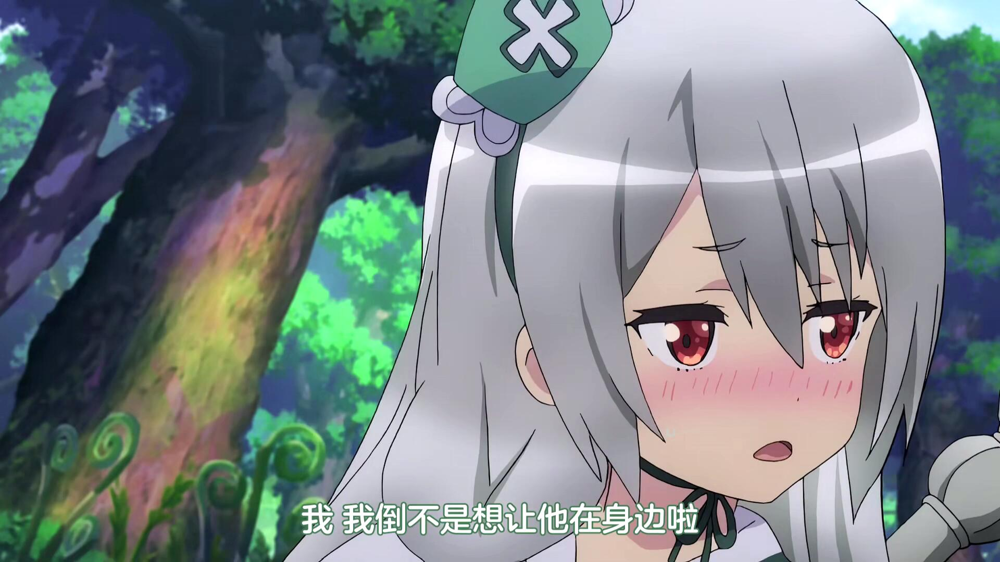

我觉得对于我这种补番党，除了单元剧，要评价一部动画好不好看最容易的就是看我看完它的时间长不长，如果一部动画对我来说好看的话，毫无疑问是看了一集就想接着看下一集的，看完所花的时间必然不会过长。

**间谍过家家2：（2023/1/8 01:50）**

连续13集无间断看完。

和1一样，符合预期，很好看，尤其是后面几集。中间有一集感觉意义不明，放了个阿尼亚的纯路人同学作为主角的小插曲，老实说没啥意思（这里只是作铺垫，后面还有出场的话当我没说）。后面出场的白毛青梅竹马好惨啊，对打网球那里蚌埠住了，女主不愧是战力天花板，球拍切碎网球（物理）给我看呆了，这部动画也一样没有打破青梅打不过天降的命运吗）如果不想写男女主感情线的话可以让她上位吗？多好一女孩子啊。

**转生成为剑：（2023/1/8 23:30）**

一天看完。

观感总体来说还好，制作组是知道我想看什么的，女主好可爱。剧情的话总体来说比较典，但是不妨碍我最后还是能感动一下。

买护具那里有作画失误，前一秒黑色过膝袜，下一秒光腿，再下一秒又穿上了。这类失误看过好多，包括但不限于魔法少女小圆、开挂药师的奇幻世界悠闲生活等等。什么？你问我为什么总能看到这种穿帮镜头？xp使然罢了，它将我的目光引导到了该看的地方，注意力集中了自然而然就经常能看到。

**4人有着各自的秘密：（2023/1/14 08:40）**

半天看完。（下午坐高铁回家的路上看的，前一晚刚好在通宵，没睡觉，在车上看到一半爆困，又是无座票，精神状态寄了，后面回家睡了一觉，早上补完）

无厘头搞笑向动画，但是部分情节有点踩雷，鉴于本人的雷点非常敏感和扭曲，一般看这动画的人根本在意不到，就不提出来了x）

类似男高、女高的风格，几个好朋友聚在一起，然后发生一些趣事，搞笑程度上的话感觉一般，整体看下来的话还算值得看，毕竟有个那么可爱的反差萌宇宙人妹子）。白毛白丝小萝莉的大佐你真的好强，不仅是你漫颜值天花板，还是你漫战力天花板。又可爱又强还贼讲义气，对朋友超级好，除了比较没有常识（毕竟是宇宙人）。这真的是搞笑动画的主角吗？老婆.jpg

说说角色的说话风格，比较有特色的是忍者千代和宇宙人立花，前者让我想起干物妹小埋里的希尔芬，句尾喜欢加“德斯哇”，当然没有希尔芬句句都加那么夸张就是了。立花的话就是句尾经常加“哒哟”来衬托她的“天真烂漫”人设，让我想起了f社（https://t.inari.site/xwNaltIa）的女主角们也是这样，区别是立花说的话是真天真烂漫，f社女主角们凡是这样说话的全是顶级谜语人www

还是提一嘴，搞笑向动画主角妹子不要画太好看了吧（说的就是你立花，太可爱了吧，搞得我浮想联翩）。美女设定的话可以参考齐木楠雄里的照桥心美，感觉那种程度比较合适。

**恋爱Flops：（2023/2/27 22:26）**

大概一个礼拜看完。其实挺可惜的，不该在比较忙的时候看这番，感觉更适合一次性看完。

后宫？？纯爱！！

第二集开始的光速告白剧情当时确实看傻了，不过一开始没带脑子，带着算了，就好这口的心态坚持看了下去，没想到这居然是铺垫，人傻了。还有基友你他吗居然是女的啊，我真没想到。福利发得虽然不多，但是挺对胃口的，~~karin你是绿白色胖次我是真记住了~~，第一集开场楼梯摔下来就看到了，还有个人剧情回那个姿态，我只能说好球点被戳烂了，制作组太懂了吧，~~这也太色了~~。顺便提一嘴唯一漏点的第四话，我当时在做高铁，所以那个猝不及防的漏点我是人彻底呆了的，这不是表番吗？？如果不是那个几秒的福利片头，我大概率是一天就看完了，~~后面没有漏了属实有点残念~~。 这个接吻好甜啊，真好啊真好啊，有青梅竹马真好啊。结局he不合理？我管你合不合理，不是he的话我就要开喷了，最后几集一直发刀搞得我心态挺崩的，给个be估计得难受好一阵子，我的老婆消失那种事情不要啊。

福利算是有给（虽然确实不多），不过不能当普通的恋爱喜剧来看，后面搞了点转折，不太好这口，我更喜欢一直吃糖，后面伪男和阿美利卡的变身也有点突兀了（况且不好看）。还有就是刀的问题，搞点刀真没必要吧，年纪大了吃不得刀啊，让我难受了几集你怎么赔我。画得真好看（专指青梅竹马），最后的最后，青梅到了也只是站在了门前按门铃，这样就结束我不能接受啊，最起码也要冲进去强行把男主童贞夺走再结尾吧，糖还是太少了（x。

**秋叶原女仆战争：（2023/03/10）**

断断续续看了一个多月。

感受：意义不明意义不明意义不明

你懂个锤子女仆，但凡发点福利漏个胖次我都不会觉得看这番在浪费生命了（~~该漏的时候你是真一点不漏啊，你没事吧？~~），前面开始就意义不明，一开始以为是什么表现手法，没想到真就那么轻易全杀了；枪战搞到一半还扯了点唐突又无聊还不得善终的恋爱情节（一样不知道这段的意义）；突然的发刀也是意义不明，我内心毫无波澜甚至想笑；最后的最后一堆拿着枪的人冲进店里看了一出小丑戏就全被感化了？按理说有着各种回忆、对这出戏码感触最深的女仆老大被感化了我都勉强接受了，结果呢？看完小丑戏听完嘴炮第一个开枪的就是你，反倒是其他一开始嚣张得一比嘴里一直喊着杀杀杀的无关人员被感化了朝老大开枪？最后意义不明的女主坐在轮椅上迎来了自己的36岁女仆生活，乐。

**电锯人：（2023/03/19 18:57）**

一下午看完。

还是挺有意思的，不过让我一直看下去的并不是战斗场面，而是想看战斗完后的奖励（

只能说电次作为一个好色童贞的形象~~很好代入了~~，两个没头脑和一个不高兴的三人组也算是比较经典？动画看完对玛琪玛比较好奇，比较神秘，但并没有产生太多好感，看后续吧。其实一开始是喜欢帕瓦的，但是实在不像女孩子，多看一会儿就没感觉了）。印象比较深的是叫姬野的女人，说实话有点恶心的，不是因为电次的纯情拒绝了，差点就做了，结果第二天早上两人一对话，嘿嘿，原来喜欢自己的搭档，三人组里的不高兴？那你前一晚喝醉把电次带回家差点上床是什么鬼？我只能说好似，姬野家果然没一个好女人。

日后可能补一下漫画吧，也不知道完结没有，到时候再说。

**（2023/03/21 16:18补充)**

漫画昨天看了，完整的第一部看完了。感觉一般，对玛琪玛没啥感觉是一如既往的，帕瓦好感拉满了。尤其是帕瓦被吓傻后，某一天晚上在床上紧紧抱住电次，让他压在自己身上，吸自己血，然后自己腿环抱住电次，脸非常红，露出了带点享受的表情。那个场景我只能说懂得都懂，很明显藤本树就是想表现得像性爱场景的，这才是真女主吧！顺便漫画的一页有说举行了人气投票，帕瓦是第一。然后是第二部，挺莫名其妙的，主角换成了个被霸凌的女的，电次虽然有出场，但感觉快成配角了，其他第一部的角色就更不用说了。看了一部分，没get到点，感觉挺无聊的，没看下去了，可能日后有心情了再补补吧。

**致不灭的你2：（2023/03/21 15:36）**

20集。看了一天

没有被刀哭，后面两集挺感动的倒是哭了。这番感觉升血压必备，不是不好看，是挺好看的，就是看得很难受，很压抑，各种情节让人血压很容易高。战斗力是彻底崩坏了，普通人都可以随便对付敲门者了，杀敲门者跟杀狗一样，后面完全就是在堆数量，不过问题不是很大，崩了就崩了，也不是我会在这类动画里特别关注的点。）先说一下哈亚瑟，这角色确实挺恶心人的，我有点看不懂。对不死有种扭曲的占有欲。这个第二代我以为会有什么故事的，结果光速下场了。顺便有一段很刑的对话，你才9岁啊（传了六代，后面变成了南通？（有点难蚌)，第六代是唯一的男性，也断在这代了，被一个敲门者骗了六代也是无语，对不死的感情倒是挺真，最后死得挺惨的，不过本人没什么感觉，对这个角色挺抗拒。再就是无论什么番剧我总会关注的恋爱相关的情节，王子是真勾吧好运啊，这么漂亮的妹子，还从小就喜欢他，羡慕啊羡慕，这对是he了。这漂亮程度仅次于铃了

然后是兄妹。

有点恶心的，特指兄长。天天喝酒玩女人，我不知道不死在这个b身上感受到的对妹妹的爱情是什么东西，还是说有血缘关系是你乱玩女人的理由吗？最后是花天酒地，死于酒精中毒，我只能说好似。真是可怜了王女妹妹，等了那么多年，最后还被敲门者袭击了，接受不了现实（血缘关系），灵魂没有留下来，希望在天国能活得幸福。

最后是城里的努力胖哥和一个漂亮妹子。

这对是有反转的。打架打到一半，嘿嘿嘿，妹子妈妈告诉你妹子有恋人，胖哥如同晴天霹雳，我血压也是直冲云霄，这下绿色世界了，然后继续战斗啊，胖哥拼死保护妹子的恋人，最后把自己命搭上去了，我直接血压拉满了。不是，哥们真成🤡了？这时想到了自己失败的人生，情不自禁代入了胖哥，破防了呀。好在胖哥死了之后对现有留念，灵魂没有去天国，不死后面把哥们复活了。嗨嗨嗨，又是一条好汉，才怪咯，喜欢的妹子有恋人，不是感觉死了比活着还难受？喜欢的妹子看哥们复活了，很感动过来抱住了哥们，哥们赶紧躲开，小心翼翼地说你男朋友会吃醋的，哎呀，真是丑完了，这一幕出来我都感觉还不如死了呢，起码不用活着继续受折磨，但是这时候反转来了。

妹子：啊？我没有男朋友啊？

哥们：？？？

我：？？？

一通解释才知道原来是妹子妈妈之前没有说清楚，那不是妹子的恋人，是自己的。

嗨嗨嗨，原来观众（我）才是最大的🤡，哥们可是人生赢家，就你也配代入哥们？恭喜哥们啊，有情人终成眷属，我的血压也降下来了，没有这个反转这番我能喷烂。这种误会以后能不能不要搞了，我看这番血压如果爆了，百分之八十是因为这个。

第二季的结局，不死在现代社会中醒来，就此结束，顺便说了一下第三季也会出，期待一下吧。不知道后面会整什么活，漫画大概率是不会补，没有那种欲望。

**青出于蓝1+2：（2023/06/09 17:21）**

36集，找工作、毕设花了精力，这段时间都没怎么看番。

一部老番，一开始以为是纯爱番，看一半好像是党争番，看到后面还是纯爱，总体来说还算是擦边后宫的男性向作品。故事的冲突基本没有，比较和平和日常，评分的话10分给个7分左右吧，有点无聊，但是还是挺甜的，女主很直球啊，谁又不想要一个从小就喜欢自己的青梅竹马呢？男女主的故事是没东西写了吗？最后两集居然是以女二为中心的故事。。。倒数第二集女二偷亲熟睡的男主，然后男主睡梦中叫着女主的名字，女二那个表情属实有点难蚌的。

男主初吻（有点烂活）：

女主直球告白：

男主第一次明确表明自己心意：

真有人能这么站？：

男女主接吻片段：

女二偷亲男主后，听到熟睡男主叫女主时候的表情：

**异世界悠闲农家：（2023/06/11 02:33）**

两天看完。

你是真种田啊。。。这玩意居然是个纯爱故事，虽然感情描写等于没有就是了。

很不爽的一点是都没花笔墨去刻画出场角色，就一个劲地加人数，然后讲种田，讲得很好，下次别讲了，明明好看的妹子那么多，可惜了，我宁愿是后宫番。

还有就是女主妹妹的声优倒是彻底留下印象了，初见就听着很耳熟很耳熟，一直想不起来。又出场了几次之后才听出来是《战斗员派遣中》的如月爱丽丝，仔细查了一下配过不少我知道的角色，这么有特色的声线之前居然一直没注意到。。。期待后续作品吧。

**生而为狗，我很幸福：（2023/06/18 00:51）**

看了三四天，评价是逆天。

不带脑子看看卖肉还可以，但凡带一点脑子都看不下去。

**无良公会：（2023/06/18 20:08）**

看了半天，卖肉做得不错，画面很好，吐槽役男主也很对胃口。

缺点是福利镜头很多都是魔物，没有那种倾向可能不太喜欢；然后是后期加了个伪娘，没有那种癖好，不能理解。

本来是厨15岁白毛少女的，但是第八集毒毒子主场回，可爱度直接爆炸了。

15岁白毛少女：

31岁人妻，万恶的设定：

毒毒子：

一些可爱的片段：

经典傲娇：

31岁人妻的女儿：

第八集毒毒子主场：

可爱度爆表，这里还叫了男主一声丹那sama（日语里有丈夫的意思）：

单看脸的话还是白毛好看，可惜塑造得不太讨喜：

**我心里危险的东西：（2023/06/21 00:58）**

看了一天，我宣布这是我今年到现在为止看过最好看的动画，太甜了吧。

前几天都在不带脑子看肉番，想看点恋爱，一直在等的久保同学还得等段时间完结，查了一下这动画正好完结，就看了。

画风我个人是不太喜欢的，实在没啥番看了才看的（有老动画候补，但是暂时不太想碰）

总的来说还是非常惊喜的，不知道是不是女作者的通病，怎么把男主搞得都这么喜欢~~自慰~~，更衣人偶那个也是，不过这个动画比那个可甜多了。故事以男主视角讲述，很多男主的内心独白，很多地方都让我~~回想起了以前的自己，深有感触~~（我怀疑作者原先是男的，做了变性手术，不然怎么能这么懂啊）。第七话女主吃醋的一句发言带上表情才算是表明自己喜欢男主（也可能之前就表现出来了，原谅我看不出来），我愿称这话为神回，直接当场爽到了。具体是女主旁边男生想和女主拼桌，男主制止了，然后男主和旁边女同学拼桌了，女主回头看了一眼，闹别扭、冷淡地说了一句“自分はいいんだ”（意思是自己不能和其他男生拼桌，男主却可以和其他女生拼桌），从这话开始，后面全是糖，非常甜。可能日后补补漫画吧，真的甜，~~故事讲得好画风就无所谓了~~，况且画风还越看越喜欢。

体育课跑步，第一次看到男主右眼：

男主看不见黑板，女主以为男主在看她，转过头来微笑：

吃醋，这里看得我~~好爽~~：

可爱捏：

这段话让我感同身受，勾起了痛苦的回忆，唉：

可爱捏：

又是这个，勾起了痛苦的回忆×n：

**犯人犯泽先生：（2023/06/22 17:39）**

看了半天，泡面番。

其实还挺好看的，就是很短，一集除去op、ed就五六分钟，估计是没啥活整，可惜。

**石纪元（龙水篇+新世界篇）：（2023/07/08 18:18）**

这是在6.30做高铁来工作地的时候看完的，后面入职了一直没时间，现在周末记录一下。

评价是不够看，断在了一个非常吊人胃口的地方，想看后续又得去补漫画，始终觉得还是动画对本人更有感染力，决定先放置着等后续了。普通的热血与激情，纯粹的强大，算是老少皆宜的作品。没有图了，一是人物确实不好看（动画本身也不是靠颜值吸粉的），二是在高铁上用ipad看，截图存起来啥的比较麻烦，摸了。

**久保同学不放过我：（2023/07/23 02:28）**

上班难受的，拖拖沓沓看了好久，男主的人设比较“科幻”，然后各种方面都很微妙，不太好代入，女主倒是无敌的可爱，画得很好看。剧情就是普通的甜。作为一部恋爱番来说，结尾不太令我满意，以女主回忆与男主的相遇结束，没有感情升华的情节啊（。想起来还是因为久保同学延期了才提前把“我心里危险的东西”当作代餐补了的，只能说除了女主人设，这番没有一样比得上“我心危”的，但是看了不亏，谁又不想有一段甜甜的恋爱呢？（你是信这个还是信我是秦始皇？）。

图截了很多，因为真的很可爱：

奇妙的误会（

可爱捏

穿裤袜的久保同学，~~好色哦~~

妹妹也可爱捏

世另我

戴眼镜的久保同学，虽然不喜欢眼镜，但是她说的话好好。

发烧的久保同学

考试取得好成绩，让闺蜜夸夸的久保同学

可爱度爆表，这就是恋爱中的少女吗

