我觉得对于我这种补番党，除了单元剧，要评价一部动画好不好看最容易的就是看我看完它的时间长不长，如果一部动画对我来说好看的话，毫无疑问是看了一集就想接着看下一集的，看完所花的时间必然不会过长。

**间谍过家家2：（2023/1/8 01:50）**

连续13集无间断看完。

和1一样，符合预期，很好看，尤其是后面几集。中间有一集感觉意义不明，放了个阿尼亚的纯路人同学作为主角的小插曲，老实说没啥意思（这里只是作铺垫，后面还有出场的话当我没说）。后面出场的白毛青梅竹马好惨啊，对打网球那里蚌埠住了，女主不愧是战力天花板，球拍切碎网球（物理）给我看呆了，这部动画也一样没有打破青梅打不过天降的命运吗）如果不想写男女主感情线的话可以让她上位吗？多好一女孩子啊。

**转生成为剑：（2023/1/8 23:30）**

一天看完。

观感总体来说还好，制作组是知道我想看什么的，女主好可爱。剧情的话总体来说比较典，但是不妨碍我最后还是能感动一下。

买护具那里有作画失误，前一秒黑色过膝袜，下一秒光腿，再下一秒又穿上了。这类失误看过好多，包括但不限于魔法少女小圆、开挂药师的奇幻世界悠闲生活等等。什么？你问我为什么总能看到这种穿帮镜头？xp使然罢了，它将我的目光引导到了该看的地方，注意力集中了自然而然就经常能看到。

**4人有着各自的秘密：（2023/1/14 08:40）**

半天看完。（下午坐高铁回家的路上看的，前一晚刚好在通宵，没睡觉，在车上看到一半爆困，又是无座票，精神状态寄了，后面回家睡了一觉，早上补完）

无厘头搞笑向动画，但是部分情节有点踩雷，鉴于本人的雷点非常敏感和扭曲，一般看这动画的人根本在意不到，就不提出来了x）

类似男高、女高的风格，几个好朋友聚在一起，然后发生一些趣事，搞笑程度上的话感觉一般，整体看下来的话还算值得看，毕竟有个那么可爱的反差萌宇宙人妹子）。白毛白丝小萝莉的大佐你真的好强，不仅是你漫颜值天花板，还是你漫战力天花板。又可爱又强还贼讲义气，对朋友超级好，除了比较没有常识（毕竟是宇宙人）。这真的是搞笑动画的主角吗？老婆.jpg

说说角色的说话风格，比较有特色的是忍者千代和宇宙人立花，前者让我想起干物妹小埋里的希尔芬，句尾喜欢加“德斯哇”，当然没有希尔芬句句都加那么夸张就是了。立花的话就是句尾经常加“哒哟”来衬托她的“天真烂漫”人设，让我想起了f社（https://t.inari.site/xwNaltIa）的女主角们也是这样，区别是立花说的话是真天真烂漫，f社女主角们凡是这样说话的全是顶级谜语人www

还是提一嘴，搞笑向动画主角妹子不要画太好看了吧（说的就是你立花，太可爱了吧，搞得我浮想联翩）。美女设定的话可以参考齐木楠雄里的照桥心美，感觉那种程度比较合适。

**恋爱Flops：（2023/2/27 22:26）**

大概一个礼拜看完。其实挺可惜的，不该在比较忙的时候看这番，感觉更适合一次性看完。

后宫？？纯爱！！

第二集开始的光速告白剧情当时确实看傻了，不过一开始没带脑子，带着算了，就好这口的心态坚持看了下去，没想到这居然是铺垫，人傻了。还有基友你他吗居然是女的啊，我真没想到。福利发得虽然不多，但是挺对胃口的，~~karin你是绿白色胖次我是真记住了~~，第一集开场楼梯摔下来就看到了，还有个人剧情回那个姿态，我只能说好球点被戳烂了，制作组太懂了吧，~~这也太色了~~。顺便提一嘴唯一漏点的第四话，我当时在做高铁，所以那个猝不及防的漏点我是人彻底呆了的，这不是表番吗？？如果不是那个几秒的福利片头，我大概率是一天就看完了，~~后面没有漏了属实有点残念~~。 这个接吻好甜啊，真好啊真好啊，有青梅竹马真好啊。结局he不合理？我管你合不合理，不是he的话我就要开喷了，最后几集一直发刀搞得我心态挺崩的，给个be估计得难受好一阵子，我的老婆消失那种事情不要啊。

福利算是有给（虽然确实不多），不过不能当普通的恋爱喜剧来看，后面搞了点转折，不太好这口，我更喜欢一直吃糖，后面伪男和阿美利卡的变身也有点突兀了（况且不好看）。还有就是刀的问题，搞点刀真没必要吧，年纪大了吃不得刀啊，让我难受了几集你怎么赔我。画得真好看（专指青梅竹马），最后的最后，青梅到了也只是站在了门前按门铃，这样就结束我不能接受啊，最起码也要冲进去强行把男主童贞夺走再结尾吧，糖还是太少了（x。

**秋叶原女仆战争：（2023/03/10）**

断断续续看了一个多月。

感受：意义不明意义不明意义不明

你懂个锤子女仆，但凡发点福利漏个胖次我都不会觉得看这番在浪费生命了（~~该漏的时候你是真一点不漏啊，你没事吧？~~），前面开始就意义不明，一开始以为是什么表现手法，没想到真就那么轻易全杀了；枪战搞到一半还扯了点唐突又无聊还不得善终的恋爱情节（一样不知道这段的意义）；突然的发刀也是意义不明，我内心毫无波澜甚至想笑；最后的最后一堆拿着枪的人冲进店里看了一出小丑戏就全被感化了？按理说有着各种回忆、对这出戏码感触最深的女仆老大被感化了我都勉强接受了，结果呢？看完小丑戏听完嘴炮第一个开枪的就是你，反倒是其他一开始嚣张得一比嘴里一直喊着杀杀杀的无关人员被感化了朝老大开枪？最后意义不明的女主坐在轮椅上迎来了自己的36岁女仆生活，乐。

**电锯人：（2023/03/19 18:57）**

一下午看完。

还是挺有意思的，不过让我一直看下去的并不是战斗场面，而是想看战斗完后的奖励（

只能说电次作为一个好色童贞的形象~~很好代入了~~，两个没头脑和一个不高兴的三人组也算是比较经典？动画看完对玛琪玛比较好奇，比较神秘，但并没有产生太多好感，看后续吧。其实一开始是喜欢帕瓦的，但是实在不像女孩子，多看一会儿就没感觉了）。印象比较深的是叫姬野的女人，说实话有点恶心的，不是因为电次的纯情拒绝了，差点就做了，结果第二天早上两人一对话，嘿嘿，原来喜欢自己的搭档，三人组里的不高兴？那你前一晚喝醉把电次带回家差点上床是什么鬼？我只能说好似，姬野家果然没一个好女人。

日后可能补一下漫画吧，也不知道完结没有，到时候再说。

**（2023/03/21 16:18补充)**

漫画昨天看了，完整的第一部看完了。感觉一般，对玛琪玛没啥感觉是一如既往的，帕瓦好感拉满了。尤其是帕瓦被吓傻后，某一天晚上在床上紧紧抱住电次，让他压在自己身上，吸自己血，然后自己腿环抱住电次，脸非常红，露出了带点享受的表情。那个场景我只能说懂得都懂，很明显藤本树就是想表现得像性爱场景的，这才是真女主吧！顺便漫画的一页有说举行了人气投票，帕瓦是第一。然后是第二部，挺莫名其妙的，主角换成了个被霸凌的女的，电次虽然有出场，但感觉快成配角了，其他第一部的角色就更不用说了。看了一部分，没get到点，感觉挺无聊的，没看下去了，可能日后有心情了再补补吧。

**致不灭的你2：（2023/03/21 15:36）**

20集。看了一天

没有被刀哭，后面两集挺感动的倒是哭了。这番感觉升血压必备，不是不好看，是挺好看的，就是看得很难受，很压抑，各种情节让人血压很容易高。战斗力是彻底崩坏了，普通人都可以随便对付敲门者了，杀敲门者跟杀狗一样，后面完全就是在堆数量，不过问题不是很大，崩了就崩了，也不是我会在这类动画里特别关注的点。）先说一下哈亚瑟，这角色确实挺恶心人的，我有点看不懂。对不死有种扭曲的占有欲。这个第二代我以为会有什么故事的，结果光速下场了。顺便有一段很刑的对话，你才9岁啊（传了六代，后面变成了南通？（有点难蚌)，第六代是唯一的男性，也断在这代了，被一个敲门者骗了六代也是无语，对不死的感情倒是挺真，最后死得挺惨的，不过本人没什么感觉，对这个角色挺抗拒。再就是无论什么番剧我总会关注的恋爱相关的情节，王子是真勾吧好运啊，这么漂亮的妹子，还从小就喜欢他，羡慕啊羡慕，这对是he了。这漂亮程度仅次于铃了

然后是兄妹。

有点恶心的，特指兄长。天天喝酒玩女人，我不知道不死在这个b身上感受到的对妹妹的爱情是什么东西，还是说有血缘关系是你乱玩女人的理由吗？最后是花天酒地，死于酒精中毒，我只能说好似。真是可怜了王女妹妹，等了那么多年，最后还被敲门者袭击了，接受不了现实（血缘关系），灵魂没有留下来，希望在天国能活得幸福。

最后是城里的努力胖哥和一个漂亮妹子。

这对是有反转的。打架打到一半，嘿嘿嘿，妹子妈妈告诉你妹子有恋人，胖哥如同晴天霹雳，我血压也是直冲云霄，这下绿色世界了，然后继续战斗啊，胖哥拼死保护妹子的恋人，最后把自己命搭上去了，我直接血压拉满了。不是，哥们真成🤡了？这时想到了自己失败的人生，情不自禁代入了胖哥，破防了呀。好在胖哥死了之后对现有留念，灵魂没有去天国，不死后面把哥们复活了。嗨嗨嗨，又是一条好汉，才怪咯，喜欢的妹子有恋人，不是感觉死了比活着还难受？喜欢的妹子看哥们复活了，很感动过来抱住了哥们，哥们赶紧躲开，小心翼翼地说你男朋友会吃醋的，哎呀，真是丑完了，这一幕出来我都感觉还不如死了呢，起码不用活着继续受折磨，但是这时候反转来了。

妹子：啊？我没有男朋友啊？

哥们：？？？

我：？？？

一通解释才知道原来是妹子妈妈之前没有说清楚，那不是妹子的恋人，是自己的。

嗨嗨嗨，原来观众（我）才是最大的🤡，哥们可是人生赢家，就你也配代入哥们？恭喜哥们啊，有情人终成眷属，我的血压也降下来了，没有这个反转这番我能喷烂。这种误会以后能不能不要搞了，我看这番血压如果爆了，百分之八十是因为这个。

第二季的结局，不死在现代社会中醒来，就此结束，顺便说了一下第三季也会出，期待一下吧。不知道后面会整什么活，漫画大概率是不会补，没有那种欲望。

**青出于蓝1+2：（2023/06/09 17:21）**

36集，找工作、毕设花了精力，这段时间都没怎么看番。

一部老番，一开始以为是纯爱番，看一半好像是党争番，看到后面还是纯爱，总体来说还算是擦边后宫的男性向作品。故事的冲突基本没有，比较和平和日常，评分的话10分给个7分左右吧，有点无聊，但是还是挺甜的，女主很直球啊，谁又不想要一个从小就喜欢自己的青梅竹马呢？男女主的故事是没东西写了吗？最后两集居然是以女二为中心的故事。。。倒数第二集女二偷亲熟睡的男主，然后男主睡梦中叫着女主的名字，女二那个表情属实有点难蚌的。

男主初吻（有点烂活）：

女主直球告白：

男主第一次明确表明自己心意：

真有人能这么站？：

男女主接吻片段：

女二偷亲男主后，听到熟睡男主叫女主时候的表情：

**异世界悠闲农家：（2023/06/11 02:33）**

两天看完。

你是真种田啊。。。这玩意居然是个纯爱故事，虽然感情描写等于没有就是了。

很不爽的一点是都没花笔墨去刻画出场角色，就一个劲地加人数，然后讲种田，讲得很好，下次别讲了，明明好看的妹子那么多，可惜了，我宁愿是后宫番。

还有就是女主妹妹的声优倒是彻底留下印象了，初见就听着很耳熟很耳熟，一直想不起来。又出场了几次之后才听出来是《战斗员派遣中》的如月爱丽丝，仔细查了一下配过不少我知道的角色，这么有特色的声线之前居然一直没注意到。。。期待后续作品吧。

**生而为狗，我很幸福：（2023/06/18 00:51）**

看了三四天，评价是逆天。

不带脑子看看卖肉还可以，但凡带一点脑子都看不下去。

**无良公会：（2023/06/18 20:08）**

看了半天，卖肉做得不错，画面很好，吐槽役男主也很对胃口。

缺点是福利镜头很多都是魔物，没有那种倾向可能不太喜欢；然后是后期加了个伪娘，没有那种癖好，不能理解。

本来是厨15岁白毛少女的，但是第八集毒毒子主场回，可爱度直接爆炸了。

15岁白毛少女：

31岁人妻，万恶的设定：

毒毒子：

一些可爱的片段：

经典傲娇：

31岁人妻的女儿：

第八集毒毒子主场：

可爱度爆表，这里还叫了男主一声丹那sama（日语里有丈夫的意思）：

单看脸的话还是白毛好看，可惜塑造得不太讨喜：

**我心里危险的东西：（2023/06/21 00:58）**

看了一天，我宣布这是我今年到现在为止看过最好看的动画，太甜了吧。

前几天都在不带脑子看肉番，想看点恋爱，一直在等的久保同学还得等段时间完结，查了一下这动画正好完结，就看了。

画风我个人是不太喜欢的，实在没啥番看了才看的（有老动画候补，但是暂时不太想碰）

总的来说还是非常惊喜的，不知道是不是女作者的通病，怎么把男主搞得都这么喜欢~~自慰~~，更衣人偶那个也是，不过这个动画比那个可甜多了。故事以男主视角讲述，很多男主的内心独白，很多地方都让我~~回想起了以前的自己，深有感触~~（我怀疑作者原先是男的，做了变性手术，不然怎么能这么懂啊）。第七话女主吃醋的一句发言带上表情才算是表明自己喜欢男主（也可能之前就表现出来了，原谅我看不出来），我愿称这话为神回，直接当场爽到了。具体是女主旁边男生想和女主拼桌，男主制止了，然后男主和旁边女同学拼桌了，女主回头看了一眼，闹别扭、冷淡地说了一句“自分はいいんだ”（意思是自己不能和其他男生拼桌，男主却可以和其他女生拼桌），从这话开始，后面全是糖，非常甜。可能日后补补漫画吧，真的甜，~~故事讲得好画风就无所谓了~~，况且画风还越看越喜欢。

体育课跑步，第一次看到男主右眼：

男主看不见黑板，女主以为男主在看她，转过头来微笑：

吃醋，这里看得我~~好爽~~：

可爱捏：

这段话让我感同身受，勾起了痛苦的回忆，唉：

可爱捏：

又是这个，勾起了痛苦的回忆×n：

**犯人犯泽先生：（2023/06/22 17:39）**

看了半天，泡面番。

其实还挺好看的，就是很短，一集除去op、ed就五六分钟，估计是没啥活整，可惜。

**石纪元（龙水篇+新世界篇）：（2023/07/08 18:18）**

这是在6.30做高铁来工作地的时候看完的，后面入职了一直没时间，现在周末记录一下。

评价是不够看，断在了一个非常吊人胃口的地方，想看后续又得去补漫画，始终觉得还是动画对本人更有感染力，决定先放置着等后续了。普通的热血与激情，纯粹的强大，算是老少皆宜的作品。没有图了，一是人物确实不好看（动画本身也不是靠颜值吸粉的），二是在高铁上用ipad看，截图存起来啥的比较麻烦，摸了。

**久保同学不放过我：（2023/07/23 02:28）**

上班难受的，拖拖沓沓看了好久，男主的人设比较“科幻”，然后各种方面都很微妙，不太好代入，女主倒是无敌的可爱，画得很好看。剧情就是普通的甜。作为一部恋爱番来说，结尾不太令我满意，以女主回忆与男主的相遇结束，没有感情升华的情节啊（。想起来还是因为久保同学延期了才提前把“我心里危险的东西”当作代餐补了的，只能说除了女主人设，这番没有一样比得上“我心危”的，但是看了不亏，谁又不想有一段甜甜的恋爱呢？（你是信这个还是信我是秦始皇？）。

图截了很多，因为真的很可爱：

奇妙的误会（

可爱捏

穿裤袜的久保同学，~~好色哦~~

妹妹也可爱捏

世另我

戴眼镜的久保同学，虽然不喜欢眼镜，但是她说的话好好。

发烧的久保同学

考试取得好成绩，让闺蜜夸夸的久保同学

可爱度爆表，这就是恋爱中的少女吗

**转生公主与天才千金的魔法革命：（2023/07/30 23:44）**

看这番的初心就是来看百合的，后面几集虽然剧情很烂，但是最后一集发糖发得很爽，还是满足了初心的。

女主（艾妮丝）是我全剧最喜欢的角色，这个有点大大咧咧的性格如果换成是个男的我可能早就弃番了，不知道为什么换成女孩子给我的感觉完全不一样，好萌好萌哦（，只能说这东西必须是百合，不是百合我不看。

这番的优点在于画面，非常符合我的口味，中间其实有些地方小崩，但是不影响观感，该好看的地方都是好看的就够了。剧情一坨，所以如果不是最后一集的糖我可能只能给个及格分（毕竟你又不像精灵幻想记那样能让我有代入感，况且精灵幻想记我一直觉得剧情不错。。），加上最后一集的糖能给个7/10。最后那几集实在太影响观感了，我看完了还是无法理解他们在想什么，非常意义不明，什么王女的使命啊巴拉巴拉一堆，顶级折磨，感觉磨叽得女主人设都变了。然后说说想看的百合元素：女二的人设也很磨叽，一直犹犹豫豫的下不了决心，战斗力表现的高光时刻在最后一集和女主单挑上（笑），要不是女主真的很可爱戳到我的点了我可能早就看不下去了。话说一开始就很自然地认为女主才是攻的那一方，谁能想到到了晚上你咋变得这么娇羞，简直是少女得不拿少女（笑死，更喜欢了，太萌了）。

最后放一下画面，真的很好看：

虽然我觉得女主更可爱，不得不承认女二初见是真的美（

摄影师你是知道我想看什么的，这不今晚加个鸡腿？

女主真的很萌

百合一下

见到飞龙的女主露出的超级可爱表情

这已经算表白了吧，不结婚很难收场.jpg

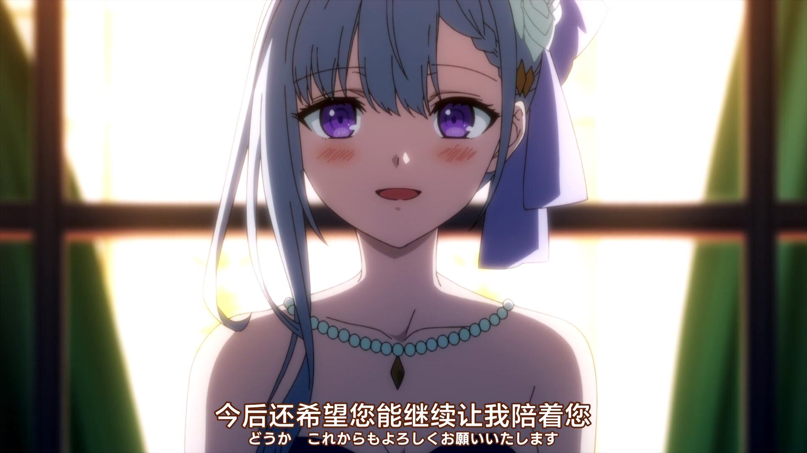

黑眼圈也是一种萌点

女主有点屑的憋笑表情

摄影师加鸡腿+1

呆呆的表情也很可爱

然后，这是我觉得全剧最好看的妹子

有一种，后宫起火的美

这绝对是做了吧

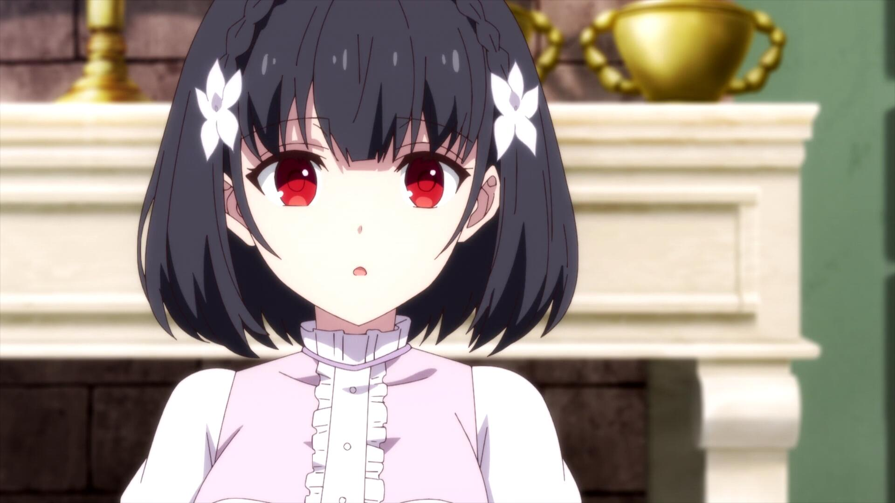

小时候的女主

这也能百

要被萌死了

老女人也可爱捏（

不愧是最好看的妹子

说我看了12集就是为了看这段也不为过

你原来这么娇羞啊，原来女二才是攻啊（

被女二吃干抹净了，悲（喜）

怎么可以露出这么可爱的表情

我还以为是求婚仪式呢（

只敢亲脸颊的纯情女主

敢于亲嘴唇的女二

**无神世界中的神明活动：（2023/08/26 18:55）**

花了周末的半天看完。

好久没有一口气看番了，随便挑了部看看，倒是能一口气看下去。观感说实话一般，有燃的点也有让人感觉恶心的点，不会卖肉可以不卖，你全是正常剧情我都给个好评了。沙比基友的存在让整部番的观感下降了一半，用汤中的老鼠屎来形容再合适不过了，呸。

是一部搞笑向异世界战斗番，男主很屑，一开始觉得很可爱的女主越后面越路人化，感觉很可惜。

第一集一来就有的几乎是明示的告白让我觉得没准还能嗑嗑cp，后来发现是我想多了。

甚至有夜袭场景，你特么的后面怎么就成路人了啊，离谱

神出来之后一切都乱套了

这表情我没蚌住

第一眼就觉得很可爱

这是动画吗？如是。它真是动画吗？如是。

还挺帅

只能说，可爱捏

这眼神可以的

你如果真转病娇了我就粉了

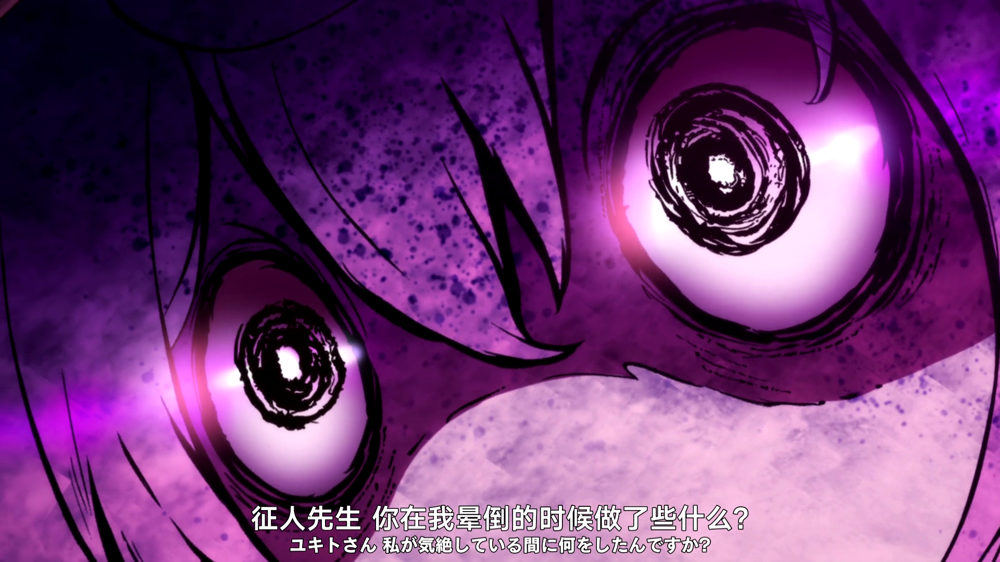

摆滑稽脸的神大人

这是经费实在不够，拿漫画的图来用了吗？虽然观感还不错

看完后的感想是，我也想有一个对我这么好的神大人，男主你何德何能

**GAMERS电玩咖：（2023/08/27 18:18）**

花了小半天看完，由误会构成的恋爱喜剧，很乐。

第一次知道”电学“，还是比较好看的，情节非常逆天和乐，很多情节深究不了一点，得当乐子看，否则人物形象崩坏。最后一集是为了凑集数吗，讲了一整集游戏，明明前面从没有认真讲过，挺无聊的。

不像高分少女一样，没有那种钻心的多角恋胃疼情节（虽然代入一下还是会痛，呜呜）。

故事还是很精彩的，两男三女（其中男二和女三是男女朋友，这一点省去了很多我不想看的东西。。）

男主就挺，galgame男主的。。

女主人设也很普通，没什么特色，经典学校第一美少女之类的，实际到处在吃瘪。

男二，一开始以为是渣男，没想到是逆天中的逆天，搅屎棍。

女二，和男主天生一对的存在，是我最想支持的角色，但是没开始就已经输了，造化弄人。口癖很有意思，日本人开头会说的诶多、德斯、德莫等等（语气助词？）她都会说两遍，而且自称用的是”自分“。

女三，也就是男二女朋友，里面我最喜欢的角色，纯情又专一，你不是galgame女主我不是很认可。

女三

这么纯情又专一的妹子，真的我哭死

我认为最没有特色的女主，也是我前期最喜欢的角色，喜欢上男主的瞬间可爱捏

和女二的初交谈， 很符合我对社恐交谈距离的想象

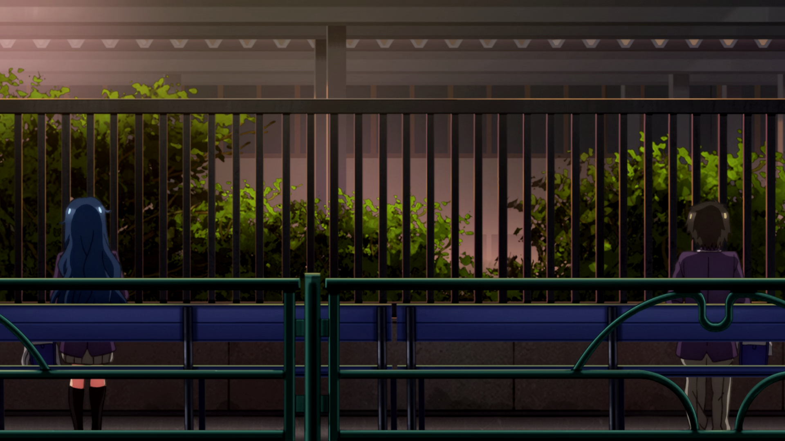

乐死了

坠入爱河的少女太可爱勒

这边产生了天大的误会，这表情真的乐死我了

不得不说男二的女朋友是整部番里我觉得最有人格魅力的角色

这女孩我真的好喜欢啊，有和我一样的三观，而且有我没有的勇气

逆天男主想要女主和他做朋友的时候脑子突然回想起昨晚打的galgame，脱口而出

女主直接答应了，乐，真就开始交往了

这个是真的，差别太大了，能自发的做一件事情是很幸福的事情

初次约会，简单来说就是好看

然后是我觉得整部番里最好看的女二

正宫还是稳啊

你小子，不认识的人都能撩（是女二的妹妹）

草泥马这一帧实在是笑死我了

这里是女二得知自己一直关系很好的网友是男主（男主还不知道）

然而男主和女主都已经交往了。。。。。

可爱到爆，可惜输麻了

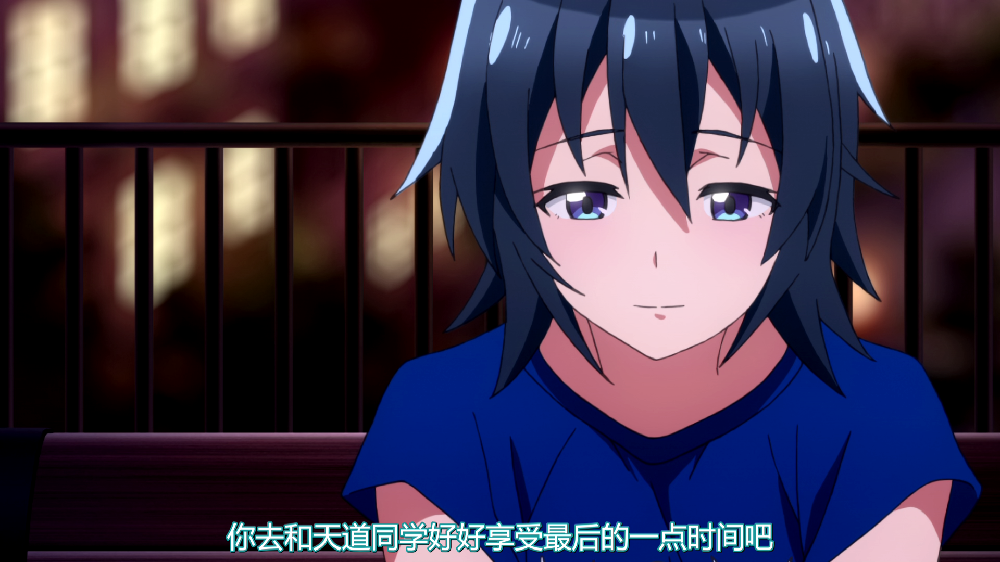

好想为她应援啊

**樱Trick：（2023/08/31 22:51）**

工作日一周看完，百合校园恋爱动画

六人女主角，两对百合，一对正常人（？）。明明是写百合的动画，上的却不是女校，男性角色别说露脸了，甚至有台词，我只能说有点微微踩雷，百合番里出现男的感觉还是不太行，很破坏观感。除此之外，~~代入感很强~~，kiss情节很爽，其他就中规中矩。动画对恋爱这种感情的描写其实很少，甚至最后一集冒出来还不知道喜欢是什么的设定，有点搞心态，但是kiss情节真的很多，每集都有，搞得我也想kiss了，kiss到底是什么感觉啊.jpg

女主春香不得不说，就是用来代入的。女二就是我老婆，小优，世界第一可爱。

👴也好可爱，这时候我还没有意识到女主是用来代入的

然后心里独白越来越多

看到老婆和别的女人说话👴就吃醋

开亲！

老婆喘气的声音好色好好听

喊出了我的心声，至此完全代入女主

老婆主动亲我

👴好震惊，震惊的表情好可爱

另一对百合

看到她们接吻，我和老婆也不能输

你是懂学习的

亲

舔雪糕（

以为👴要亲她的小优好可爱

最后👴还是亲了她

趁👴睡着了，偷偷把👴身上舔了个遍的小优，好。。好可爱！！

理由也好。。。好可爱！

好色哦

👴这是发情了？

👴真是罪孽深重的女人，不知不觉间就攻略了姐妹花。。你小子.jpg

吃醋的优，好可爱，可以多来点这种情节，真的好可爱

老婆！

狠狠亲她

老师你的发型好危险哦

👴真是罪孽深重的女人

吃醋了吃醋了，大庭广众之下蒙层布就开始狂亲

再次说出了我的心声，代入感up！

狠狠扑到

可恶，是~~男~~女人能忍？

亲！

好！

水里也要接吻，👴是接吻狂魔！

已经成为一种习惯了（

老爹你说得好啊，不过你放心，👴只会和女生结婚！（这是少有的不反感的男性角色出场的地方了）

我去，好色，天气冷真好啊（x

又可爱又色，老婆老婆你和我结婚吧，没有你我可怎么活啊😭😭

结婚！

结，现在就结，不结不是人！

不愧是👴，吻上去了

我家老婆真是可爱

老婆😭😭！我也想听到你的声音，没有你的声音我根本就睡不着觉😭😭

没办法，老婆太可爱了，谁来都一样

老婆谢谢你😭😭

亲，我现在就飞进二次元亲亲

我老婆上课睡觉的样子也好可爱

我家老婆怎么可以这么可爱

亲

狠狠滴伸舌头

我真是罪孽深重的女人

岳父岳母对不起，我是罪孽深重的女人，你们的两个女儿都喜欢我

这个翻译有点意思

无论多少次我都要说，我真是罪孽深重的女人

老婆我也喜欢你哦

**处刑少女的生存之道：（2023/09/04 23:50）**

看了三四天，今天下班回来看最后一集。

比较无聊的动画，无论是贴贴还是战斗做得都挺无聊，感情也很平淡，单纯来看妹子的话女主的两个后宫倒是不错，女主不太行，烂。

同样是百合开后宫，樱Trick的代入感就拉满了，你这我完全无法代入，根本不知道你在想什么，动画后面几集感觉编剧还有恶趣味，整点了比较瘆人的画面，唯一不错的地方就是摄影师知道该拍哪，鸡腿还是得加。

女主小时候的样子可爱度爆表，“打扮”之后烂完了。

女二倒是画得不错

异世界换衣物后加上白丝是好文明

每次这种火车场景总会让我想起来永生之酒啊

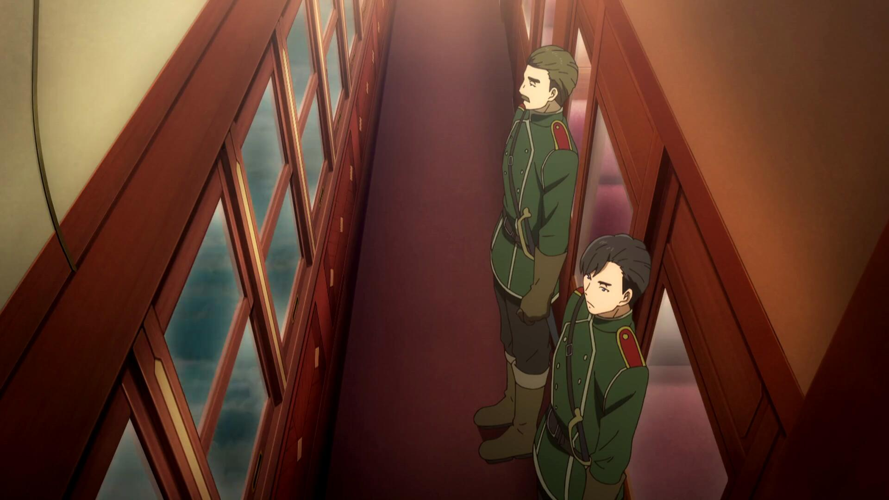

人设没塑造好，分不清是在说真话还是假话

你这表情有半点惊讶的感觉吗。。

你为什么在娇喘啊喂

你这哪是感觉痒的表情啊

小时候真的萌，打扮牛魔呢

别吧，你导师都丑成啥样了

原来的发型好看多了，这个导师审美有问题

momo能不能给我

同样是百合番，同样是开后宫，这个女主根本没法代入啊，如果是樱Trick的情节我早乐开花了，这里毫无波澜

你是懂我想看什么的，摄影师加鸡腿！

可爱捏

我去，病娇？？？

这表情真逗

你知不知道你到底在说啥

好

心形舌头和嘴巴

加鸡腿，好想要momo踩我啊

想被踩++

😍

可爱可爱

老子根本不懂你在想什么，不是复仇，而是为了向那群nt证明自己？？？？？

生病了也好可爱

笑起来好可爱啊，把我的心都夺走了😍

momo当我老婆吧求求你了，没有你我可怎么活啊😭😭

**织田信奈的野望：（2023/09/09 02:20）**

工作日每天看几集，小一周看完了。

穿越回战国时代在娘化武将堆里开后宫，剧情不能深究，比较儿戏，基本是来看妹子的番，后面几集还挺燃。人设很不错，主要是比较符合我的胃口，冲这个就挺值得一看。（最大的败笔是男主不是萝莉控，不能接受）

开局就是经典朴实无华的梦想，奠定了番剧的基调，主动是喜剧化，不会太严肃，适合我这种玻璃心。

男主这头发烂完了，整正常点也不会这么难看

有点可爱

你认真的？不懂幼女好的人有难咯

脸红还是好看的

真会撩啊

这一幕很不错，好有感觉

傲娇已经过时了，哦，是12年的旧番啊，那没事了

帅

忍者二人组好帅好可爱

你吗会魔法的服部半藏谁打得过啊

是个妹子就不杀是吧，真有你的w

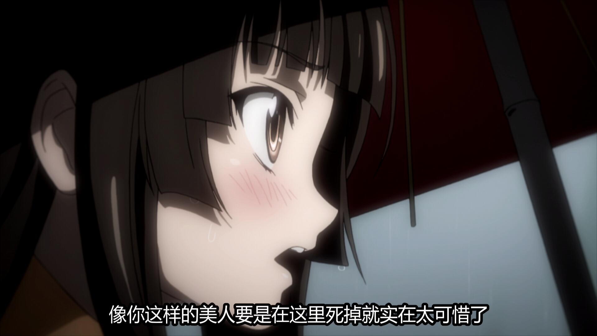

老婆！

怎么会欺负你呢？狠狠疼爱！😍

我觉得也是

最好看的妹子

你说的最好是施法

这种想法贯穿了始终，是我对这动画很满意的地方

老婆，结婚！😭

你吗这是什么结婚宣言？？😭😭

好可爱好可爱啊，当时就是因为她来看这动画的，来了血赚！

傲娇已经退环境了

好可爱

乐

我看你是完全不懂萝莉的好哦

我去，中二病！

萝莉真多啊，男主不是萝莉控真是这番的一大败笔

😋

这白丝真好看🥵

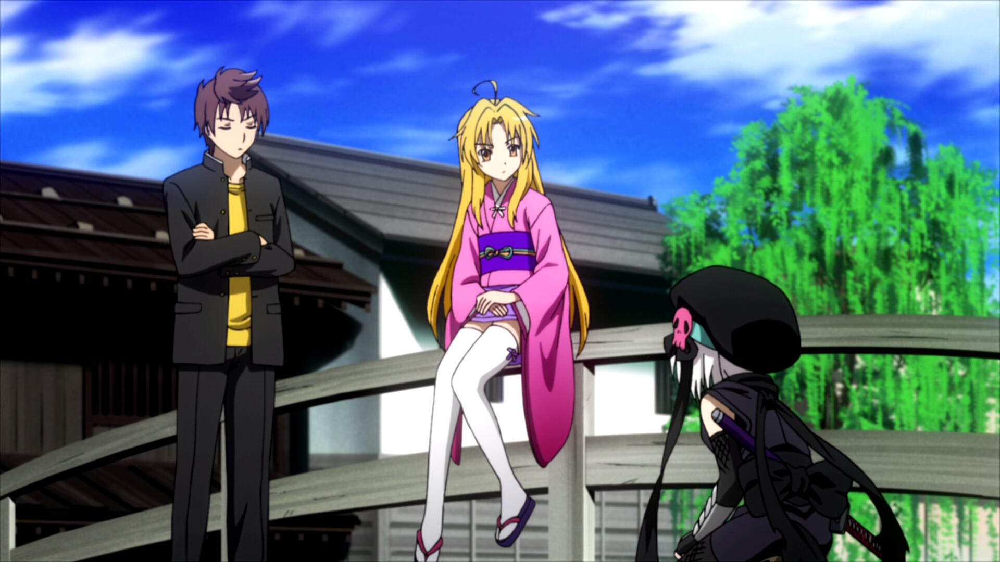

最可爱的萝莉

忍者妹妹也可爱

可以读心的萝莉，乐

可爱

被✌攻略了

我去

我是超级后宫王🥰

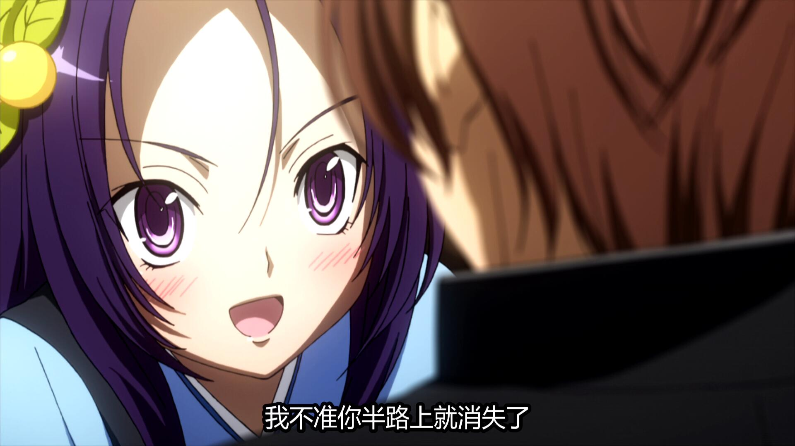

未婚妻可爱捏

😍

为什么不是萝莉控啊，不能接受

草，这么严肃的氛围，你问的什么吊话，给整笑了

兄弟们还是你们和我xp像

全剧最帅的人，服部半藏，没啥戏份就是了

虽然我不这么觉得。

老婆！

再说一次，未婚妻可爱捏

有点帅

正宫的命令

最后还是众人面前抱在一起了

凯旋归来，你们离我老婆远点！！

**千绪的通学路：（2023/09/17 22:49）**

大概一周看完，搞笑乐子番，几乎没有严肃的地方，有点像女高，就是逆天程度更高，有些地方太出格了。

危险动作，请勿模仿

草，很符合我对社恐的想象

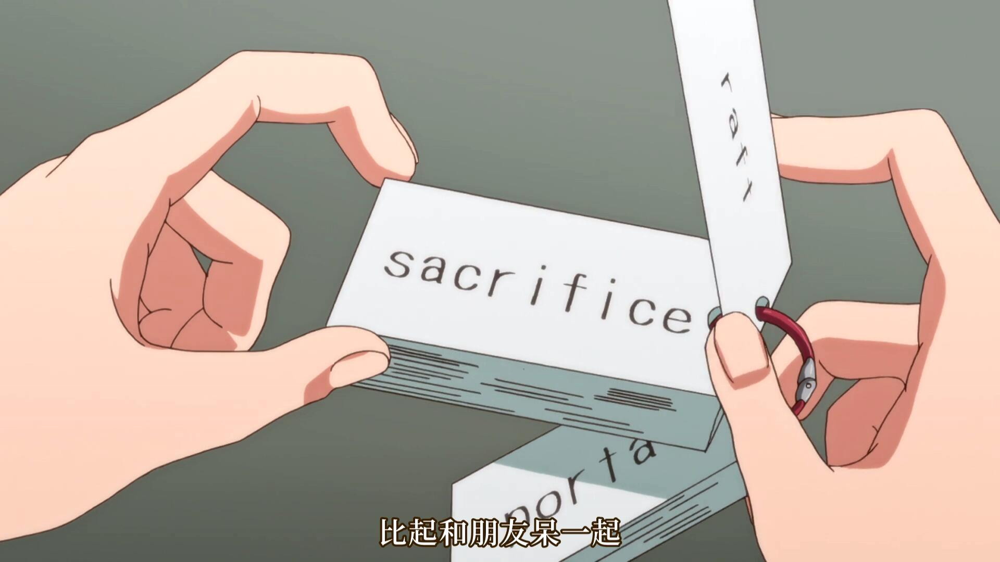

前期笑点还是很足的，这里非常草

大哥你是真要笑死我

哥们你演技爆表

哥们你人真好啊

这里有点帅的

难她天？

我去，变态！

正论

误解

笑死我了这个画面一切

非常抽象

不要命了 ，不要模仿啊，真的很危险的

坏了，小学题我也不会

**冰海战记 第二季：（2023/09/19 23:17）**

24集，工作日的情况下两天看完了。写战争的，之前说的织田信奈的野望是把战争当儿戏，这个就是深刻在描述战争的残酷，写了一堆悲剧，男主和第一季比真就换了个人，种田先种了12集，后面又参与了第二季女主角的悲剧故事，最后悟出了战士之道，嘴炮走了来侵略的国王。。

大众评价非常高，但是我不是很喜欢，只能说题材还是不适合我，我更喜欢看美少女。因为几乎没有美少女或者笑点，所以几乎也没什么图。

一来就是地主家的傻儿子有这么（相对其他角色）可爱的女人，草，这个逼傻儿子我是真看得恶心，最后的成长也不太能接受。

无论何时，妹控总是令人肃然起敬（不过你后续怎么好像没有出场了。。。）

经典语句，你到底是懂还是不懂，如懂

真懂吗？如懂

这真是时光飞逝，突然就砍了三年树。。。

典

乐

草

**异世界舅舅：（2023/09/27 16:31）**

一天看完，满分10分给10分，看下来感觉非常舒服的一部动画，题材是搞笑+战斗+恋爱，没有很深度的剧情，却给了我无与伦比的体验，各方面都好，各方面可能都说不上顶尖，但是都达到了我的期待，我想看的全都有，让我非常满意，这是今年看的其他任何动画都做不到的，所以只能给满分了。

女二的脸很好看，性格非常残念

说实话一开始以为她是那种努力家类型的

舅舅是真抽象，这么懂别人，自己的又一点不懂

不愧是有血缘关系的人，侄子也一样抽象

😊可爱捏

你是懂我想看什么的

可爱

好有感觉

捏妈妈的，好可爱

动不动就做出表白宣言的舅舅是屑

草，居然是中文

艹，ba

女三登场，也是超级无敌可爱

记忆清除！

可爱可爱

乐，这是什么乙女动画吗？不过这两青梅竹马对这么可爱的女生居然不喜欢，很难怀疑是不是男同

真的好可爱啊，可以说是最戳我的角色

笑死我了，八月飞雪

这不结婚很难收场

好可爱的小虎牙呀

没关系，你可爱度爆表

怎么回事呢

可爱捏

老婆！

草泥马，笑死我了

果然还是这个才是正宫，这里还以为要从傲娇变成病娇了，~~有点爽~~

真会撩啊你

我去

笑死我了，都让你卑完了，旁边两位的表情也太乐了

好好好，没有这个13集，我是不会给满分的

想看的全都有了

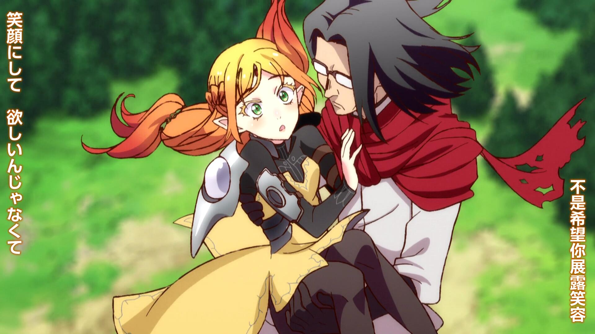

~~虽然最后又在迫害傲娇女主，不过无伤大雅~~

**全部成为F：（2023/09/28 20:58）**

看了半天看完，高铁上用平板看的，所以没有图，不过就这番而言，也不需要了。

悬疑推理向动画，谜语人发言挺多。剧情挺恶心人的，观感不太好，~~不负责的联通傻狗能不能别恶心人~~，人设也不太行，女主是华哥配的，不过脸真的不好看，不是声音好听就烂完了，对不上电波。

**文豪野犬第四季+第五季：（2023/10/02 17:57）**

一天看完，第四季一如既往的高水准，燃点反转都有，开头还是我最喜欢的江户川乱步，第五季就比较一般了，情节很牵强甚至是扯淡，作为群像剧各个角色的细分也有些把握不好了，镜花两季真就在打酱油？还有新双黑也是真的丑陋。。。最后还埋了伏笔，看还是会看的，期待一下第六季。几乎没有什么妹子的moe镜头就没什么图了，~~男人的图不截了~~。

这一幕是真漂亮，不过角色定位很复杂，关于她的能力展现也感觉没什么卵用，随便换个啥能力故事一样能进行

最后面还是有萌妹子的，就是她拔圣剑的情节我觉得全剧最离谱，不知道第六季有没有解释，实在是太扯淡了。

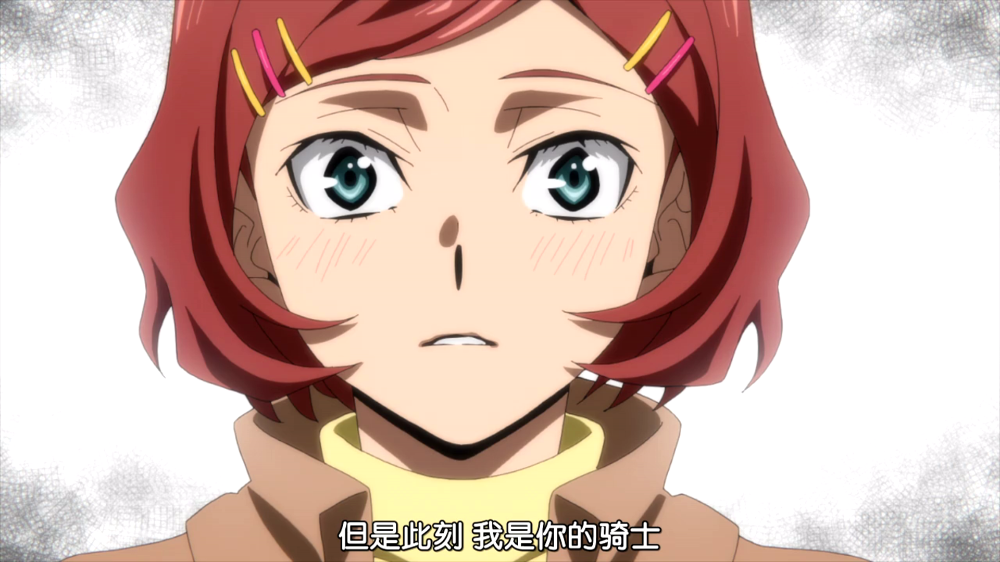

**女神的露天咖啡厅：（2023/11/07 23:27）**

看了一个月，党争单结局动画，党争、感情要素集中在后两集，前面是在铺垫感情？虽然我觉得铺垫得也挺水的，不得不说做得挺无聊的，人设也一般，卖肉也不太行，就只有后面两集还不错。这一个月主要是上班导致的，没什么精力，看番也越来越少了，前几天10.31倒是花了2w左右买了新电脑，显示器很大，挺不适应的，用着新电脑看完了剩下的三四集。感觉没有五等分好看，属于能看的级别。

因为换了新电脑，之前的图倒是没有了，只有最后几集的图了

本作最喜欢的妹子：

小时候黑发的样子可爱到爆，怎么就染发了呢

懂装不懂的女人

好好好，后面两集还是得夸

还挺有节目效果的，接连告白是吧

好家伙，突然给个有女儿的镜头，注定不是后宫结局了

